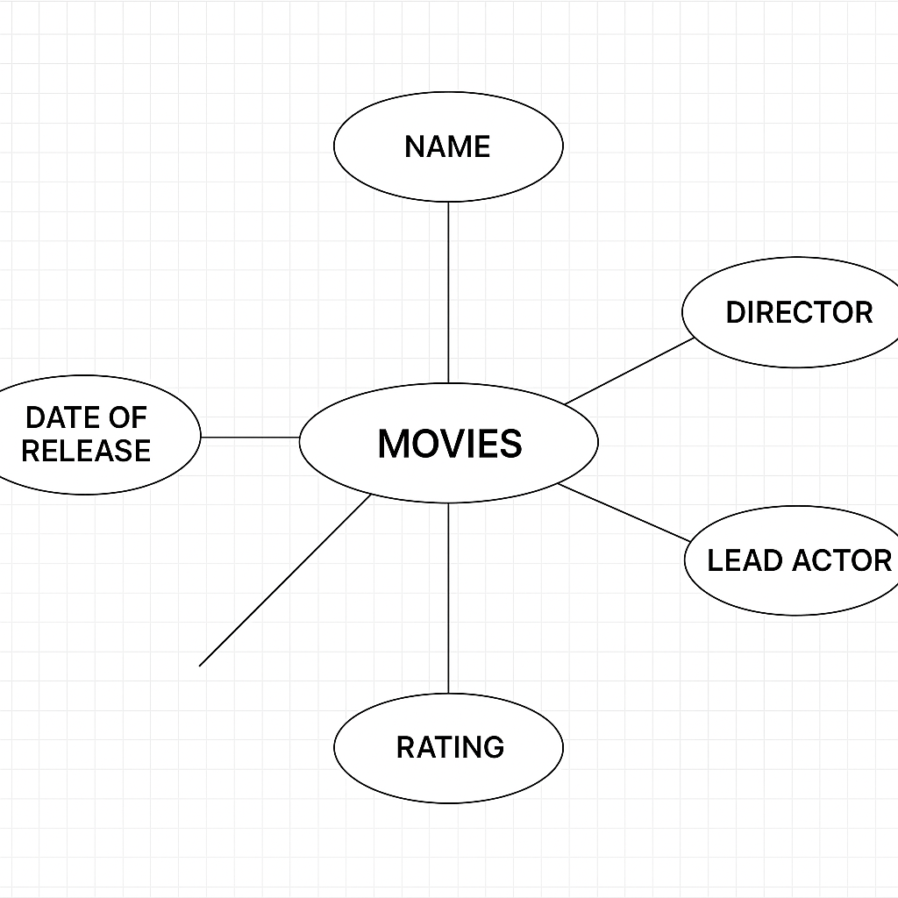

# Ex02 Django ORM Web Application
## Date: 23-04-2025

## AIM
To develop a Django application to store and retrieve data from Movies Database using Object Relational Mapping(ORM).

## ENTITY RELATIONSHIP DIAGRAM




## DESIGN STEPS

### STEP 1:
Clone the problem from GitHub

### STEP 2:
Create a new app in Django project

### STEP 3:
Enter the code for admin.py and models.py

### STEP 4:
Execute Django admin and create details for 10 books

## PROGRAM
```
admins.py

from django.contrib import admin
from .models import Movie

admin.site.register(Movie)

models.py

from django.db import models

class Movie(models.Model):
    title = models.CharField(max_length=100)
    director = models.CharField(max_length=100)
    release_year = models.IntegerField()
    rating = models.FloatField()

    def __str__(self):
        return self.title

```

## OUTPUT


## RESULT
Thus the program for creating a database using ORM hass been executed successfully
